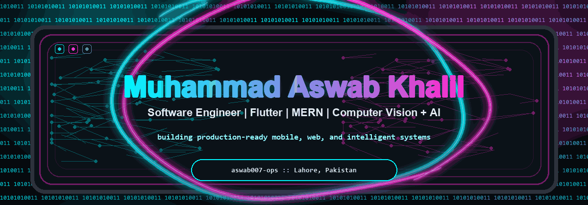
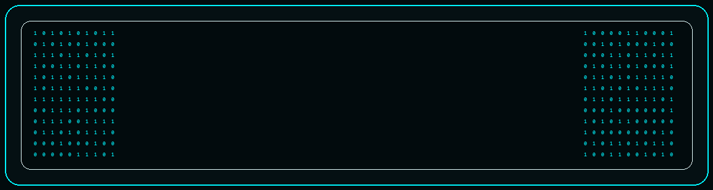
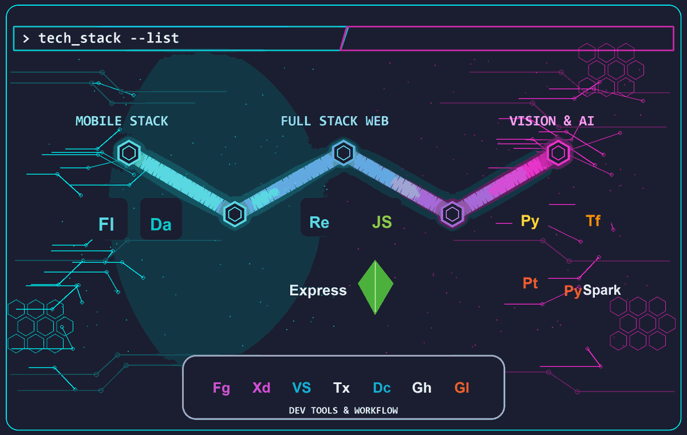

  

  <code><strong>&gt; Active Mission Profile:</strong></code>

   

  

   

  
  
  

    

  
  
  

  

  

<table>
  <tr>
    <td>

### <code>&gt; github_stats --scan</code>

  
  

    

  

    </td>
  </tr>
</table>

<table>
  <tr>
    <td>

### <code>&gt; project_log --featured</code>

 

<table>
  <tr>
    <td width="33%">
      <code>&gt; project_log/01</code> 
      <strong>RozGo</strong> 
      MERN gig-income tracker with JWT auth, Cloudinary uploads, analytics, PDF export, and admin review flows.
    </td>
    <td width="33%">
      <code>&gt; project_log/02</code> 
      <strong>Camera Model</strong> 
      Computer vision work around camera geometry, epipolar constraints, and 3D reconstruction foundations.
    </td>
    <td width="33%">
      <code>&gt; project_log/03</code> 
      <strong>Vehicle Inspection Mobile App</strong> 
      Flutter inspection workflow with camera capture, damage mapping, offline-first storage, and sync-ready submission.
    </td>
  </tr>
</table>

    </td>
  </tr>
</table>

<table>
  <tr>
    <td>

### <code>&gt; connect --open-channel</code>

  
  
  

    </td>
  </tr>
</table>

<code>// end of transmission_</code>

