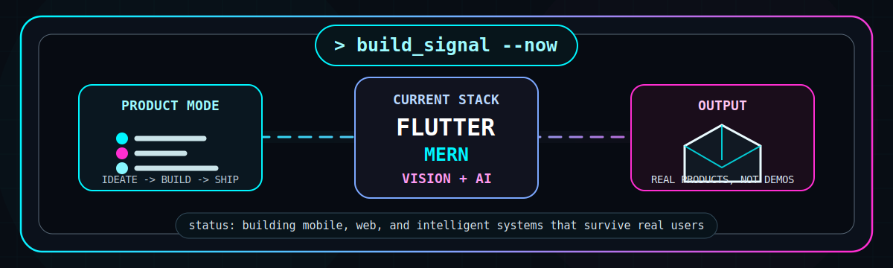
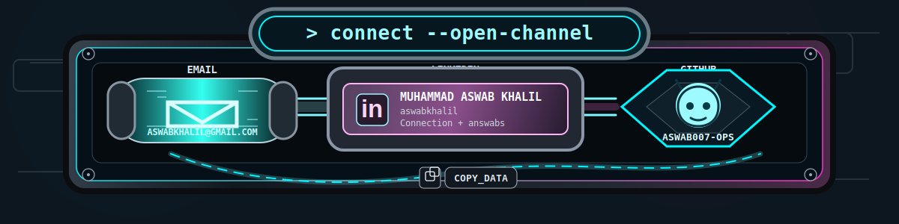

  

  <code><strong>&gt; Active Mission Profile:</strong></code>

   

  

   

  
  
  

    

  
  
  

  

  

  

  

   
  
    <a href="mailto:aswabkhalil@gmail.com"><code>email</code></a>
    &nbsp;|&nbsp;
    <a href="https://www.linkedin.com/in/muhammad-aswab-khalil-b578a235a/"><code>linkedin</code></a>
    &nbsp;|&nbsp;
    <a href="https://github.com/aswab007-ops"><code>github</code></a>
  

<code>// end of transmission_</code>

