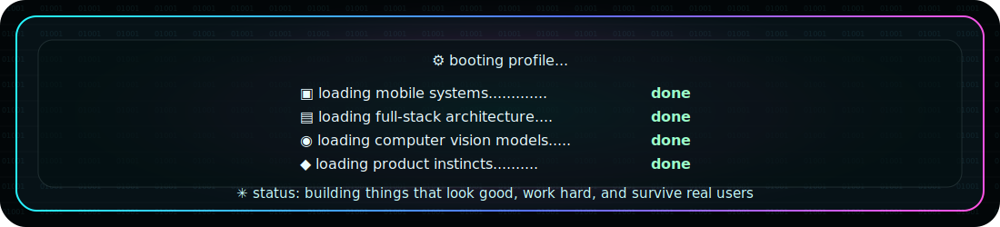
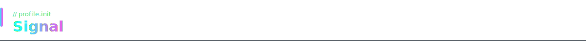
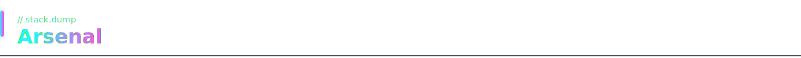
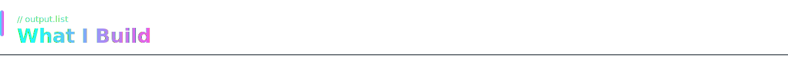
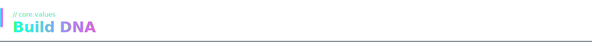
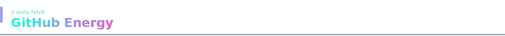
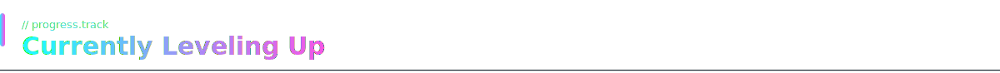
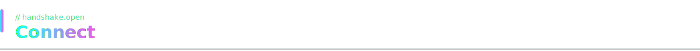

<div align="center">

  

  <a href="https://github.com/aswab007-ops">
    
  </a>

  <br />

  
  
  

</div>


<div align="center">
  
</div>




<table>
  <tr>
    <td width="55%" valign="top">

## Signal

I am a **Software Engineer** and **BS Artificial Intelligence** student at ITU Lahore, building across mobile, full-stack web, and applied computer vision.

My favorite work sits where product polish meets engineering depth: camera workflows, offline-first data capture, dashboards, media pipelines, authentication, image processing, and systems that feel finished from the first tap.

> I am not here to collect random repos. I am here to build sharp, useful software with real-world edges.

    </td>
    <td width="45%" valign="top">

## Current Stack

```yaml
current_stack:
  mobile:
    - Flutter
    - Dart
    - Provider
    - GoRouter
    - Camera workflows
    - Offline storage

  web:
    - React
    - Node.js
    - Express
    - MongoDB
    - JWT auth
    - Tailwind CSS

  ai_cv:
    - OpenCV
    - NumPy
    - OCR
    - ResNet
    - SIFT / BoVW
    - 3D reconstruction
```

    </td>
  </tr>
</table>




## Arsenal

<div align="center">

  

  <br /><br />

  
  
  
  
  

</div>




## What I Build

<table>
  <tr>
    <td align="center" width="25%">
      
      <br />
      <strong>Production Mobile Apps</strong>
      <br />
      Flutter apps with structured flows, API integration, image capture, and offline-safe behavior.
    </td>
    <td align="center" width="25%">
      
      <br />
      <strong>Full-Stack Platforms</strong>
      <br />
      MERN systems with auth, dashboards, file uploads, analytics, and clean user journeys.
    </td>
    <td align="center" width="25%">
      
      <br />
      <strong>Vision + AI Systems</strong>
      <br />
      Image processing, recognition, OCR, feature extraction, model evaluation, and geometry.
    </td>
    <td align="center" width="25%">
      
      <br />
      <strong>Product-Ready Flows</strong>
      <br />
      Architecture, state, data modeling, deployment, and UX that does not feel unfinished.
    </td>
  </tr>
</table>




## Build DNA

<div align="center">

| Layer | What I Care About |
|:---|:---|
| **Interface** | Clean screens, obvious actions, fast comprehension |
| **State** | Predictable flows, recoverable sessions, low friction |
| **Backend** | Auth, APIs, validation, storage, media, deployment |
| **Vision** | Features, geometry, image pipelines, model comparison |
| **Shipping** | Source control, maintainability, practical tradeoffs |

</div>




## GitHub Energy

<div align="center">

  
  

  <br /><br />

  

</div>




## Currently Leveling Up

<div align="center">

  
  <br />
  
  <br />
  
  <br />
  
  <br />
  

</div>




## Connect

<div align="center">

  <a href="mailto:aswabkhalil@gmail.com">
    
  </a>
  <a href="https://www.linkedin.com/in/muhammad-aswab-khalil-b578a235a/">
    
  </a>
  <a href="https://github.com/aswab007-ops">
    
  </a>

</div>

<div align="center">

  

</div>
